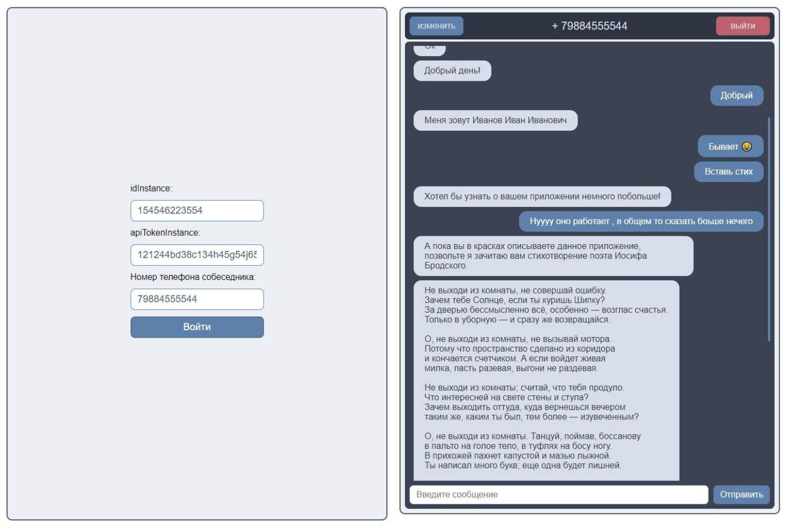

# Тестовое задание на должность - Фронтенд разработчик React

Это приложение является тестовым заданием, позволяет отправлять и получать текстовые сообщения WhatsApp через HTTP API 
[Green-API](https://green-api.com/) (требуется регистрация). 

Вводятся

- idInstance - уникальный номер аккаунта
- apiTokenInstance - ключ доступа аккаунта
- phone - номер телефона собеседника в международном формате без "+", (пример: 79898886655)

Работу приложения можно посмотреть по ссылке [Green-api-test](https://voodo13.github.io/green-api-dist/)




## Запуск приложения
Скачать zip архив с репозитория GitHub и распаковать, либо выполнить в консоли:
```
git clone https://github.com/Voodo13/green-api-test.git
cd green-api-test
```
Находясь внутри папки с проектом, установить зависимости
```
npm install
```

### Запуск проекта в режиме разработки
```
npm run dev
```
Далее перейти по ссылке [http://127.0.0.1:5173/](http://127.0.0.1:5173/)

### Сборка проекта
```
npm run build
```
Проект будет собран в ./dist
